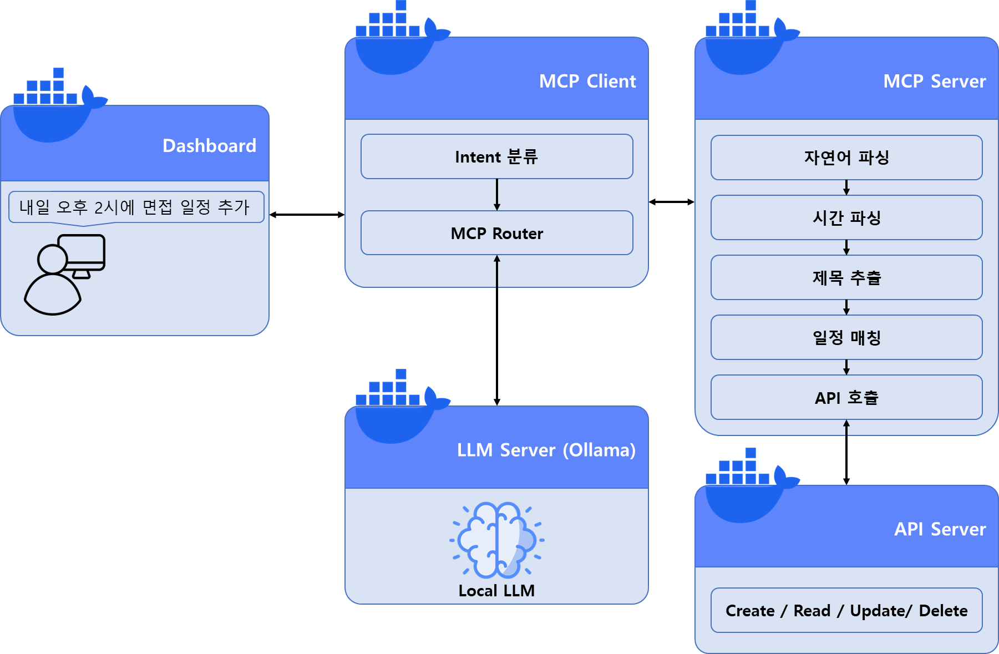

# Local AI Agent 기반 일정 관리 시스템

자연어로 말하면 일정이 등록되고, 조회되고, 수정되고, 삭제된다.
외부 API 없이 **로컬에서만 동작**하는 MCP 기반 AI Agent 시스템이다.

```
"내일 오후 2시에 면접 일정 추가해줘"
   → 9월 3일(목) 오후 2시 · 면접 일정을 등록했습니다.
```

기간: 2026년 2월 5일 ~ 3월 31일 · 태그: `AI Agent` `MCP` `LLM` `Docker Compose`

---

## 만든 이유

ChatGPT 기반 자동화는 외부 API 의존성과 비용, 그리고 동작 제어의 한계가 있었다.
"내가 통제할 수 있는 Agent를 로컬에서 직접 만들어 보자"는 것이 출발점이었고,
특히 MCP(Model Context Protocol)의 Agent 아키텍처를 직접 구현해서 이해하는 것이 목표였다.

단순한 챗봇이 아니라 **자연어 입력이 실제 API 실행으로 이어지는 실행 중심 Agent**를 만들었다.

---

## 동작 예시

실제 실행 결과다. (`make smoke`로 재현할 수 있다)

```
사용자 > 내일 오후 2시에 면접 일정 추가해줘
에이전트 > 9월 3일(목) 오후 2시 · 면접 일정을 등록했습니다.
          intent=create_schedule (rule) / tool=create_schedule(83.7ms)

사용자 > 내일 오후 2시 30분에 팀 회의 잡아줘
에이전트 > 그 시간에 이미 9월 3일(목) 오후 2시 · 면접 일정이 있습니다. 그래도 등록할까요?
          intent=create_schedule (rule) / tool=create_schedule(90.0ms)

사용자 > 네
에이전트 > 9월 3일(목) 오후 2시 30분 · 팀 회의 일정을 등록했습니다.
          intent=confirm (rule) / tool=create_schedule(100.7ms)     ← force=true로 재실행

사용자 > 내일 면접을 오후 5시로 옮겨줘
에이전트 > '면접' 일정을 9월 3일(목) 오후 2시에서 9월 3일(목) 오후 5시로 옮겼습니다.
          intent=update_schedule (rule) / tool=update_schedule(123.5ms)

사용자 > 내일 면접 취소해줘
에이전트 > 9월 3일(목) 오후 5시 · 면접 일정을 삭제했습니다.
          intent=delete_schedule (rule) / tool=delete_schedule(113.5ms)
```

대시보드는 응답과 함께 **요청이 거쳐 간 5단계와 각 단계의 소요 시간**을 보여준다.
어떤 규칙으로 Intent가 정해졌고, 어떤 Tool이 몇 ms 만에 실행됐는지가 화면에 그대로 남는다.

---

## 아키텍처



```
Dashboard → MCP Client (Intent 분류 · Tool 선택) → MCP Server (파싱 · Tool 실행)
                    ↓                                          ↓
              LLM (Ollama)                              API Server (일정 데이터)
```

| 컨테이너 | 역할 |
|---|---|
| **Dashboard** | 입력, 응답, Tool 실행 로그 시각화 |
| **MCP Client** | Agent. Intent를 분류하고 적절한 Tool을 선택·호출 |
| **MCP Server** | Tool 실행 서버. 자연어를 일정 정보로 변환하고 API를 호출 |
| **LLM (Ollama)** | 로컬 LLM. Intent 보조 분류와 응답 문장 생성 |
| **API Server** | 일정 CRUD와 시간 충돌 검증 등 비즈니스 로직 |

자세한 설계 근거는 [docs/ARCHITECTURE.md](docs/ARCHITECTURE.md)에,
로컬 LLM 성능 문제를 90초에서 739ms로 줄인 과정은
[docs/TROUBLESHOOTING.md](docs/TROUBLESHOOTING.md)에 정리했다.

---

## 실행

필요한 것은 Docker와 Docker Compose뿐이다.

```bash
git clone <repo> && cd local-mcp-calendar-agent
cp .env.example .env
make up          # 또는 docker compose up -d --build
```

대시보드는 http://localhost:3000 에서 열린다.

첫 실행에는 LLM 모델(기본 `qwen2.5:3b`, 약 2GB)을 내려받는 시간이 걸린다.
모델이 준비되기 전에도 시스템은 **규칙 라우팅 + 템플릿 응답으로 정상 동작**하며,
상태 표시등의 LLM만 노란색으로 뜬다.

```bash
make logs        # 로그 보기
make smoke       # 실제 대화를 넣어 흐름 확인
make test        # 단위 테스트 71개
make down        # 종료
```

모델을 바꾸려면 `.env`의 `OLLAMA_MODEL`만 수정하면 된다. LLM이 별도 컨테이너라 다른 곳은 손댈 필요가 없다.

| 서비스 | 주소 |
|---|---|
| 대시보드 | http://localhost:3000 |
| MCP Client (Agent) | http://localhost:8003/docs |
| MCP Server (Tool) | http://localhost:8002/mcp |
| API Server | http://localhost:8001/docs |

---

## 프로젝트 구조

```
.
├── docker-compose.yml
├── dashboard/              # nginx + Vanilla JS (빌드 도구 없음)
├── mcp-client/             # Agent
│   └── app/
│       ├── router.py       #   Rule 기반 Intent Router  ★ 핵심
│       ├── mcp_gateway.py  #   MCP 표준 SDK 통신
│       ├── llm.py          #   Ollama 클라이언트
│       └── main.py         #   요청 흐름 오케스트레이션
├── mcp-server/             # Tool 실행 서버
│   └── app/
│       ├── server.py       #   MCP Tool 5개 정의
│       ├── api_client.py
│       └── nlu/
│           ├── datetime_parser.py   # 한국어 시간 파싱  ★ 핵심
│           ├── title.py             # 제목 추출
│           └── matcher.py           # 일정 매칭
├── api-server/             # 도메인 API (AI를 전혀 모른다)
├── docs/ARCHITECTURE.md
└── scripts/
```

---

## 설계에서 부딪힌 것들

### 1. MCP 구조가 직관적이지 않았다

LLM, Tool, Client 사이의 역할이 처음에는 불명확했다. 특히 "Agent를 어디에 둘 것인가"가 정해지지 않아
초기 설계가 계속 흔들렸다.

요청 흐름을 UI → Agent → Tool → API 로 단계마다 분해하고, **"LLM은 판단, 실행은 Tool"** 로 역할을 재정의했다.
MCP Client를 Agent Layer로, MCP Server를 Tool 실행 전용으로 못박고 나서야 구조가 잡혔다.

MCP는 통신 프로토콜이라기보다 **Agent(Client) - Tool(Server) - API로 역할을 쪼개는 아키텍처 패턴**에 가깝다는 것이
이 프로젝트에서 얻은 가장 큰 이해다.

### 2. LLM이 설계한 대로 동작하지 않았다

가장 심각했던 문제다. Tool 선택을 LLM에 맡겼더니 같은 문장에도 다른 Tool을 골랐다.
**수정 요청을 "삭제 후 재생성"으로 처리해서 원본 일정이 사라지는** 케이스까지 나왔다.

원인은 LLM의 선택이 확률적이라는 것, 그리고 그것을 통제할 로직이 없다는 것이었다.

그래서 판단 순서를 뒤집었다.

```python
TOOL_BY_INTENT = {
    CREATE: "create_schedule",
    LIST:   "list_schedules",
    UPDATE: "update_schedule",
    DELETE: "delete_schedule",
}
# 이 표에 없는 Intent는 어떤 경우에도 Tool을 호출하지 않는다
```

1. 규칙으로 잡히면 규칙을 따른다 (결정적, 재현 가능)
2. 규칙이 실패할 때만 LLM에 보조 분류를 요청한다
3. LLM의 응답도 화이트리스트를 통과해야 한다. 못 통과하면 실행하지 않고 되묻는다

우선순위도 규칙으로 고정했다. `update`를 `delete`보다 위에 둬서 "취소하고 4시로 변경해줘" 같은 입력이
삭제로 새지 않게 했고, 이 경계는 회귀 테스트로 박아 두었다.

> LLM 기반 시스템에서는 "자유도"보다 **"제어"** 가 중요하다.
> Rule 기반 Router를 함께 써야 일관된 동작이 보장된다.

### 3. "내일 3시"를 datetime으로 바꾸기

이것도 LLM에 맡기지 않았다. 같은 문장에 다른 값이 나오면 안 되는 영역이기 때문이다.

규칙 파서를 1순위로 두고, 규칙이 실패한 표현만 `dateparser`로 넘긴다.
규칙 파서는 매칭된 **구간(span)** 을 함께 반환하는데, 덕분에 제목 추출기가
"문장에서 시간 표현만 정확히 도려낸" 나머지를 다룰 수 있다.

작업하며 잡은 실제 버그들:

| 증상 | 원인 | 해결 |
|---|---|---|
| "회의" → "회", "치과" → "치" | 조사 제거가 명사의 끝 글자를 먹음 | 조사를 뗀 뒤 한 글자만 남으면 조사가 아니라고 판단 |
| "내일 면접을 5시로" 에서 대상이 "내" | 조사 기반 정규식이 문장을 잘못 자름 | 시간 표현의 위치를 기준으로 분할 |
| "10시 30분"이 30분짜리 일정이 됨 | '30분'을 소요 시간으로 오인 | '분'에는 동안/간/짜리 표지를 필수로 요구 |

---

## 테스트

```bash
make test
```

```
── api-server ──   10 passed     충돌 검증, 경계값(14~15시와 15~16시), 소요시간 유지
── mcp-server ──   33 passed     시간 파싱 회귀 케이스, 제목 추출, 일정 매칭
── mcp-client ──   28 passed     Intent 라우팅 경계, 결정성, LLM 응답 화이트리스트
전체 통과
```

파싱 규칙을 고칠 때마다 예전에 되던 표현이 깨지는 일이 반복돼서,
실제로 입력했던 문장들을 그대로 테스트 케이스로 고정해 두었다.

---

## MCP Tool 목록

| Tool | 설명 |
|---|---|
| `create_schedule(text, force)` | 문장에서 일정을 만들어 등록. 충돌 시 되물음 |
| `list_schedules(text)` | 기간·키워드로 조회 |
| `update_schedule(text, force)` | 대상 일정을 찾아 시간 변경. 소요 시간은 유지 |
| `delete_schedule(text, schedule_id)` | 대상 일정을 찾아 삭제. 모호하면 실행하지 않음 |
| `parse_only(text)` | 실행 없이 파싱 결과만 확인 (디버깅용) |

---

## 문제가 생기면

**LLM 상태등이 노란색이다** — 모델이 아직 준비되지 않았다. `make pull`로 다시 받거나 `docker compose logs ollama-init`을 확인한다. 이 상태에서도 등록·조회·수정·삭제는 모두 동작한다.

**응답이 느리다** — CPU에서 LLM을 돌리면 문장 생성에 수 초가 걸릴 수 있다. `.env`에서 `LLM_ENABLED=false`로 두면 템플릿 응답으로 즉시 동작한다. GPU가 있다면 `docker-compose.yml`의 `deploy` 블록 주석을 해제한다.

**시간이 이상하게 해석된다** — `parse_only` Tool로 파싱 결과만 확인할 수 있다. 오전/오후가 없는 1~6시는 오후로 해석하는 것이 의도된 동작이다.

**포트가 충돌한다** — `.env`에서 포트를 바꾼다.

로컬 LLM 응답 지연, nginx DNS 캐싱 등 실제로 겪은 문제의 원인 분석과 해결 과정은
[docs/TROUBLESHOOTING.md](docs/TROUBLESHOOTING.md)에 정리했다.

---

## 앞으로 할 것

- [ ] 멀티 유저 지원 (인증·세션 관리, 사용자별 일정 분리)
- [ ] RAG 기반 일정 추천 (과거 일정 패턴으로 자동 일정 생성)
- [ ] 시간 파싱 정확도 개선 (LLM + Rule Hybrid 파싱으로 확장)
- [ ] 일정 충돌 검증 고도화 (우선순위, 자동 재조정)
- [ ] In-Memory DB → PostgreSQL 전환 (`store.py` 교체만으로 가능하도록 설계해 둠)
- [ ] Tool 확장을 고려한 플러그인 구조
